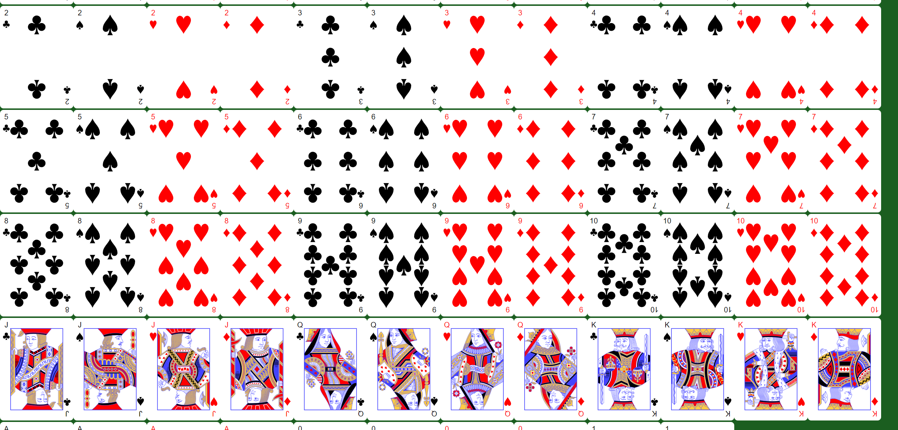
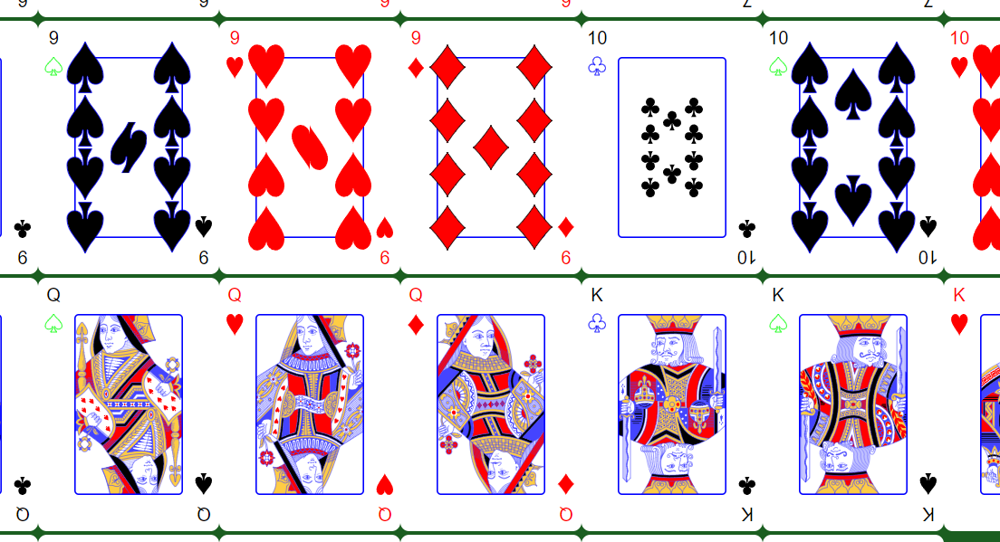

# Playing Cards

One page application to generate SVG playing card layouts of a variety of sizes, colors among other things.

Example with some not so regular options

## This is not finished

This is a personal project that is going slowly, i dont know when it will be done (or if) but i decided to public it incase anyone else needed something similar.

Check package.json for commands for building / running it

I will try keep everything that is being worked on or needs to be worked on in issues on the off chance someone stumbles upon this and wants to help

## Goal

While i wasnt dissapointed with other card generating options, they either had no customisability, the wrong output or for the wrong framework. So to get everything i wanted while allowing the outputs of other generators this project spawned. The only goal tihs project sacrifices is file size, while they wont be the smallest, they also wont be inefficient with size.

1. Above all else, this should be a static site / page. All libraries should be baked into the site to allow for offline use.
2. Full customisability, if there is a hardcoded value that affects the look of the cards it should be changable by the user.
3. Custom card decks, if i want 0-13 or A-10+J-Q-K i should be able to set those
4. Outputs should allow for atleast
    - 1 File per card output
    - 1 File with a sheet of all cards with customisable grid order and size

Future possibilities (things i wanted)

- Outputs for card printing sites
- Outputs for tabletop simulator

## Other projects i found

The only one i based a lot of this off of is https://www.me.uk/cards

## Honour Card SVG formatting

Each honour card needs to be formatted in a specific way for the svg.js to extract the correct information, i have been using inkscape to edit any files with the following process

All Clones are first unlinked (this allows direct editing of the paths). Edit -> Clone -> Unlink Clone or Shift + Alt + D

Then some paths are merged together (for example groups of the same paths in different locations), this is done using Path -> Combine or Ctrl + K while all layers are selected

All paths are then transformed to remove the matrix transform, this is done using https://github.com/Klowner/inkscape-applytransforms

Paths are then manually simplified or split into different layers as needed, this is done by just duplicating the path and removing any points not needed.

All these paths are then named `layer-#` with the following being the coloring standard

| #  | Purpose    |
|----|------------|
| 0  | Rotate     |
| 1  | Yellow     |
| 2  | Yellow     |
| 3  | Yellow     |
| 4  | Red        |
| 5  | Red        |
| 6  | Red        |
| 7  | Blue       |
| 8  | Blue       |
| 9  | Blue       |
| 10 | Black      |
| 11 | Black      |
| 12 | Black      |
| 13 | Suit Color |
| 14 | Suit Color |
| 15 | Suit Color |
| 16 | Blue Trim  |
| 17 | Blue Trim  |
| 18 | Blue Trim  |

Layer 0 is optional and defaults to the center of all paths

All svg files should be pushed with all layers visible
